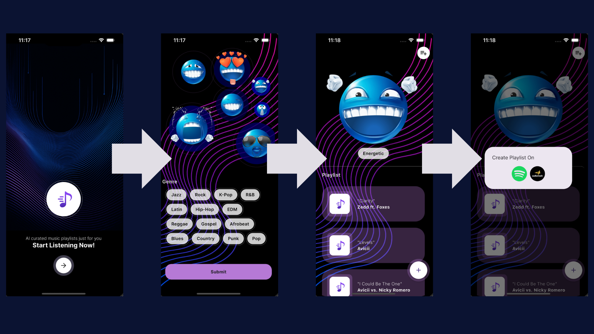

  

<h1 align="center">HarmonAI</h1>

  An application that recommends Mood/Genre based AI-curated music playlists using Flutter, OpenAI, Spotify, and Audiomack! 🎶🤖

# Project Snippet

# Project Description

HarmonAI is a mobile application that utilizes OpenAI's API to generate AI-curated music playlists based on 
the selections of the user's preferred mood and either a singular or multiple chosen genre(s). The app relies
on the power of Flutter as the front-end of the application, OpenAI for chatbot recommendations, and Spotify/Audiomack 
integration for smooth playlist integration. 

Main Features:
  1. Single-Option Mood Selection
  2. Multiple-Option Genre Selection
  3. Playlist Regeneration
  4. Simple Playlist Creation and Addition

# Project Programs
This section outlines the programs and any major frameworks or libraries that were used within this project.

- [Flutter](https://docs.flutter.dev/get-started/install)
- [OpenAI](https://platform.openai.com/api-keys)
- [Spotify](https://developer.spotify.com/dashboard)
- [Audiomack](https://audiomack.com/labtestingapi/song/easy-lab-testing-api)
- [Visual Studio Code](https://code.visualstudio.com/)

# How To Deploy Application

## Prequisites
  1. Open [Flutter](https://docs.flutter.dev/get-started/install) link and select your cooresponding device(ex. macOS for Apple users).
  2. Choose your type of application(ex. IOS for iPhone users) and follow along with the guideline to download all required dependencies.
  3. Download your preferred IDE(ex. This application was made through [Visual Studio Code](https://code.visualstudio.com/)) for main programming and application visualization.
  4. Ensure that all systems within your device are updated, which includes Xcode(if on macOS), Xcode Simulator(if on macOS), and any system setting updates.

Note: All these systems and programs are updatable/downloadable within the device itself or are mentioned throughout the [Flutter](https://docs.flutter.dev/get-started/install) guide.

# Contact
## Let me know if you have any inquiries. I would love to chat and help out!😁
Name: Christian Yim
Email: christianjayyim@berkeley.edu

